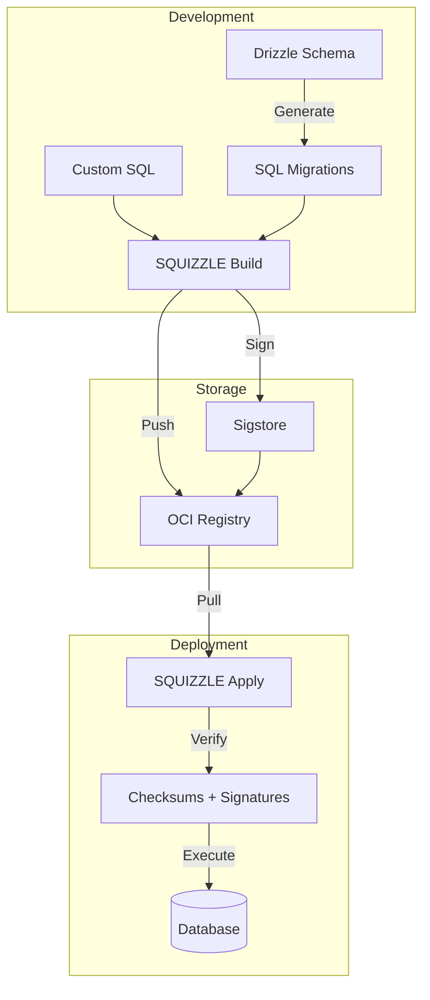

# SQUIZZLE

> Immutable, versioned, bundled data migrations

## Table of Contents

- [What is SQUIZZLE?](#what-is-squizzle)
- [Quick Start](#quick-start)
- [Packages](#packages)
- [Documentation](#documentation)
- [Examples](#examples)
- [Contributing](#contributing)

## What is SQUIZZLE?

SQUIZZLE is a production-grade database migration system that treats migrations as immutable, versioned artifacts. Think of it as "npm for database schemas" - bundle your migrations, version them, sign them, and distribute them through OCI registries.

### Key Features

- 📦 **Immutable Bundles** - Migrations are packaged into tamper-proof artifacts
- 🏷️ **Semantic Versioning** - Version your database schema like code
- 🔒 **Supply Chain Security** - Sigstore signing and checksum verification
- 🐳 **OCI Native** - Store migrations in any container registry
- 🔄 **Rollback Support** - Define backward migrations alongside forward ones
- 🚦 **Safe Concurrency** - Distributed locking prevents race conditions

## Quick Start

```bash
# Install CLI globally
npm install -g @squizzle/cli

# Initialize in your project
squizzle init

# Build and apply your first migration
squizzle build 1.0.0 --notes "Initial schema"
squizzle apply 1.0.0
```

## Packages

SQUIZZLE is organized as a monorepo with focused packages:

### Core Packages

| Package | Version | Description |
|---------|---------|-------------|
| [@squizzle/cli](./packages/squizzle-cli) |  | Command-line interface |
| [@squizzle/core](./packages/squizzle-core) |  | Core engine and interfaces |

### Database Drivers

| Package | Version | Description |
|---------|---------|-------------|
| [@squizzle/postgres](./packages/squizzle-postgres) |  | PostgreSQL driver with advisory locks |

### Storage Backends

| Package | Version | Description |
|---------|---------|-------------|
| [@squizzle/oci](./packages/squizzle-oci) |  | OCI registry storage (Docker Hub, ghcr.io, etc) |

### Security

| Package | Version | Description |
|---------|---------|-------------|
| [@squizzle/security](./packages/squizzle-security) |  | Sigstore signing and verification |

## Documentation

### Getting Started
- [Installation](./docs/installation.md)
- [Configuration](./docs/configuration.md)
- [Your First Migration](./docs/first-migration.md)

### Core Concepts
- [Immutable Artifacts](./docs/concepts/immutable-artifacts.md)
- [Version Management](./docs/concepts/versions.md)
- [Storage Backends](./docs/concepts/storage.md)
- [Security Model](./docs/concepts/security.md)

### Guides
- [CI/CD Integration](./docs/guides/cicd.md)
- [Rollback Strategies](./docs/guides/rollbacks.md)
- [Multi-Environment Setup](./docs/guides/environments.md)
- [Disaster Recovery](./docs/guides/disaster-recovery.md)

### Reference
- [CLI Commands](./docs/reference/cli.md)
- [Configuration Schema](./docs/reference/config.md)
- [API Reference](./docs/reference/api.md)

## Examples

Explore working examples:

- [Basic Migration](./examples/basic-migration) - Simple schema setup
- [With Drizzle](./examples/with-drizzle) - Drizzle ORM integration
- [Multi-Environment](./examples/multi-environment) - Dev/staging/prod setup
- [GitHub Actions](./examples/github-actions) - CI/CD pipeline
- [Kubernetes](./examples/kubernetes) - K8s deployment

## Architecture



## Why SQUIZZLE?

### The Problem

Traditional migration tools have issues:
- Files can be edited after deployment
- No cryptographic verification
- Hard to distribute across environments
- No built-in rollback strategy
- Merge conflicts with sequential numbering

### The Solution

SQUIZZLE treats migrations like software releases:
- **Immutable** - Once built, artifacts can't change
- **Versioned** - Semantic versioning for database schemas  
- **Signed** - Cryptographic proof of authenticity
- **Distributed** - Push/pull through registries
- **Auditable** - Complete history of who did what

## Comparison

| Feature | SQUIZZLE | Flyway | Liquibase | Atlas |
|---------|----------|---------|-----------|-------|
| Immutable Artifacts | ✅ | ❌ | ❌ | ✅ |
| OCI Distribution | ✅ | ❌ | ❌ | ❌ |
| Sigstore Signing | ✅ | ❌ | ❌ | ❌ |
| TypeScript Native | ✅ | ❌ | ❌ | ❌ |
| Drizzle Integration | ✅ | ❌ | ❌ | ❌ |

## Contributing

We welcome contributions! See our [Contributing Guide](./CONTRIBUTING.md) for details.

### Development Setup

```bash
# Clone the repository
git clone https://github.com/flyingrobots/squizzle.git
cd squizzle

# Install dependencies
pnpm install

# Build all packages
pnpm build

# Run tests
pnpm test
```

### Project Structure

```
squizzle/
├── packages/           # npm packages
├── examples/          # Example projects
├── docs/             # Documentation
├── docker-compose.test.yml  # Test infrastructure
└── README.md         # You are here
```

## License

MIT - see [LICENSE](./LICENSE) for details.

## Related Projects

	- [SCHRONIC](https://github.com/flyingrobots/schronic) - Time-traveling data lake companion
- [Drizzle ORM](https://orm.drizzle.team/) - Type-safe ORM for SQL
- [Sigstore](https://sigstore.dev/) - Signing infrastructure

---

<p align="center">
  Made with ❤️ by <a href="https://github.com/flyingrobots">Flying Robots</a>
  <br>
  <sub>Because database migrations should be boring</sub>
</p>